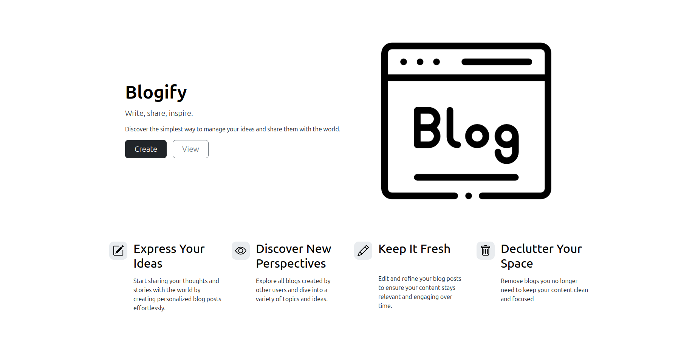
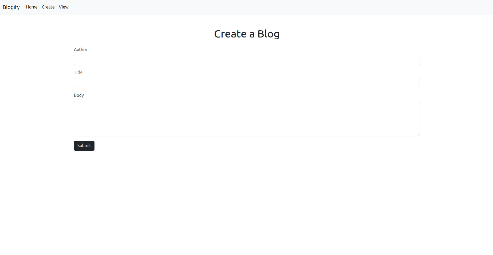
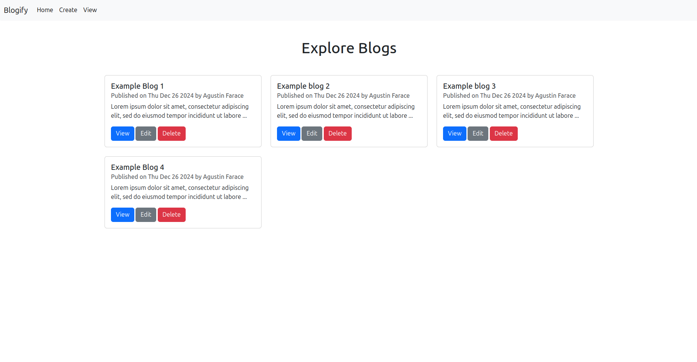
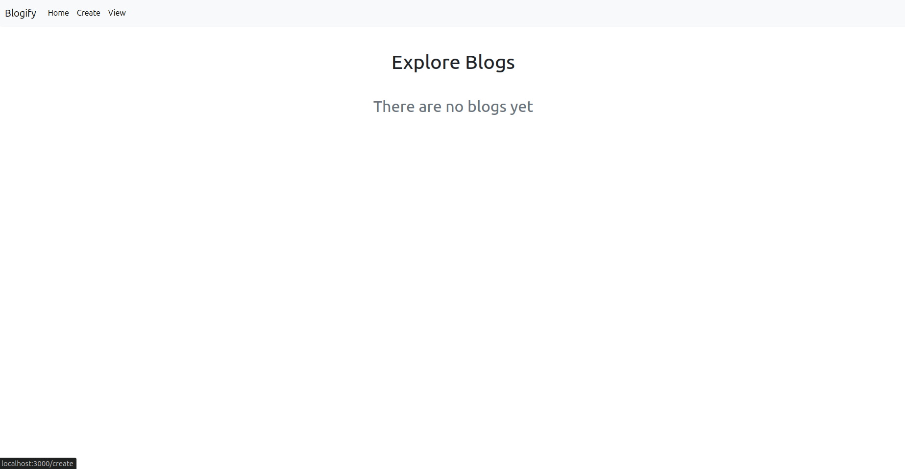
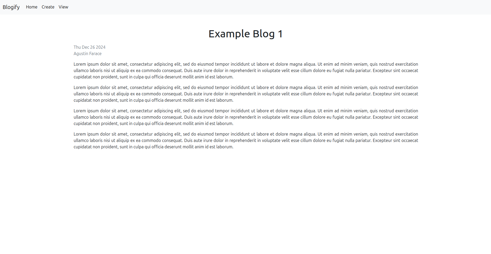
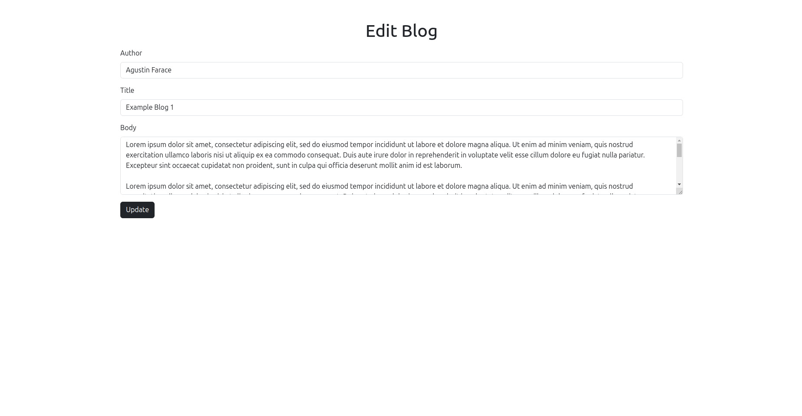

# Blogify

## Table of Contents
- [Introduction](#introduction)
- [Features](#features)
- [Installation](#installation)
- [Usage](#usage)
    - [Create a New Post](#create-a-new-post)
    - [View Existing Posts](#view-existing-posts)
    - [Read a Blog](#read-a-blog)
    - [Edit a Blog](#edit-a-blog)
    - [Delete a Blog](#delete-a-blog)
- [Contributions](#contributions)

## Introduction
Blogify is a web application that allows users to create, edit, and share blog posts. It is built with modern web technologies to provide a seamless and responsive user experience.

## Technologies

- Node.js: JavaScript runtime environment
- Express: Web application framework for Node.js
- EJS: Embedded JavaScript templating
- Bootstrap: Front-end framework

## Features
- Create, read, edit, and delete blog posts
- Responsive design

## Installation
To install and run Blogify locally, follow these steps:

1. Clone the repository:
    ```bashBlogify
    git clone https://github.com/afarace/BlogWebApp.git
    ```
2. Navigate to the project directory:
    ```bash
    cd BlogWebApp
    ```
3. Install dependencies:
    ```bash
    npm install
    ```
4. Start the development server:
    ```bash
    nodemon app.js
    ```

## Usage
Once the development server is running, open your browser and navigate to `http://localhost:3000` to start using Blogify.



On this page you can see the logo and the features of the web application. You can also buttons to create a new post or view existing posts.

### Create a New Post
To create a new post, click the "Create" button on the homepage. Also you can access to this view using the navbar when you are at other views. You will be redirected to a form where you can enter the title and content of your post.



After entering the title and content, click the "Submit" button to save your post. You will be redirected to the homepage where you can see your new post listed.

### View Existing Posts
To view existing posts, click the "View" button on the homepage. Also you can access to this view using the navbar when you are at other views. You will be redirected to a page where you can see a list of all posts that have been created.



If there are no blogs created, you will see this:



### Read a post
At view page, to view the details of a post, click the "View" button. You will be redirected to a page where you can see the full content of the post.



### Edit a post
At view page, to edit a post, click the "Edit" button. You will be redirected to a form where you can edit the title and content of the post.



After editing the title and content, click the "Submit" button to save your changes. You will be redirected to the homepage where you can see your updated post listed.

### Delete a post
At view page, to delete a post, click the "Delete" button. It will refresh the page and then you will see that the post has been removed from the list.

## Contributions
Contributions are welcome! If you find a bug or want to add a new feature, please submit a pull request.